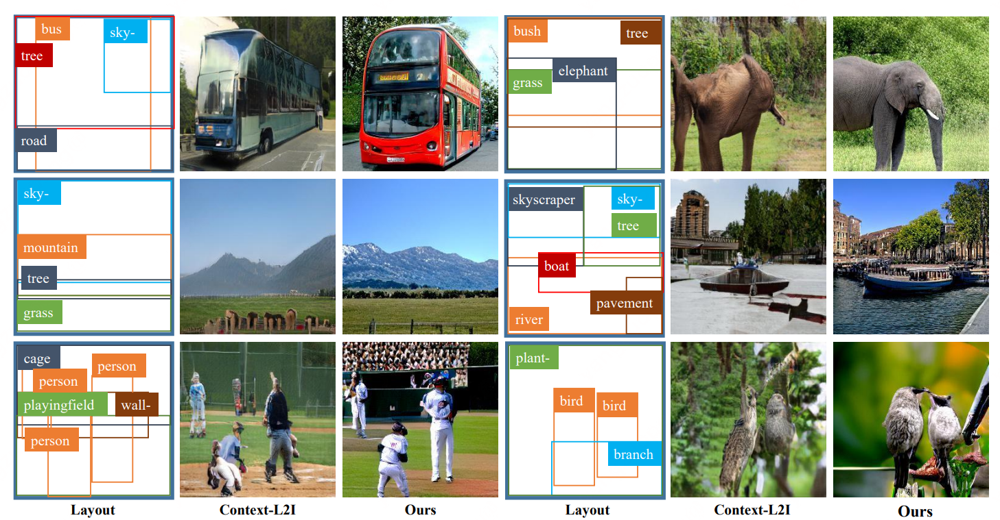
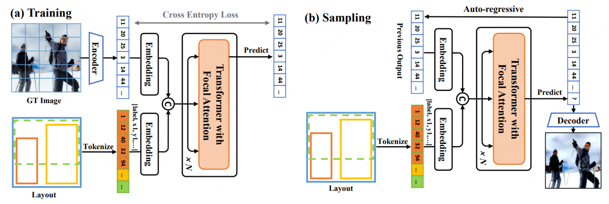
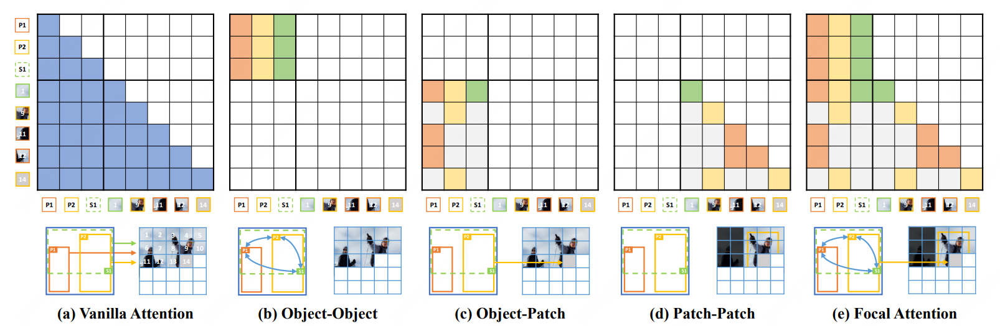
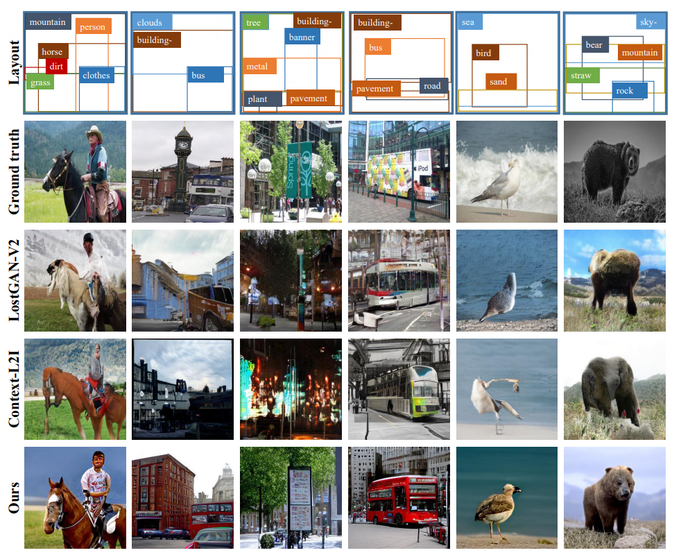

# Modeling Image Composition for Complex Scene Generation

Official PyTorch implementation of of TwFA. <br>
**Modeling Image Composition for Complex Scene Generation (CVPR2022)** <br>
Zuopeng Yang, Daqing Liu, Chaoyue Wang, Jie Yang, Dacheng Tao <br>


[arXiv](https://arxiv.org/abs/2206.00923) | [BibTeX](#bibtex)


## Overview
The overview of the proposed Transformer with Focal Attention (TwFA) framework.


The illustration of different attention mechanisms with connectivity matrix. 


## Requirements
A suitable [conda](https://conda.io/) environment named `twfa` can be created
and activated with:
```
conda env create -f environment.yaml
conda activate twfa
```


## Data Preparation

### COCO
Create a symlink `data/coco` containing the images from the 2017 split in
`train2017` and `val2017`, and their annotations in `annotations`. Files can be
obtained from the [COCO webpage](https://cocodataset.org/).

### VG
Create a symlink `data/vg` containing the images from Visual Genome. Files can be
obtained from the [VG webpage](https://visualgenome.org/). Unzip the other annotations for VG in the dir `data`.

## Sampling

### COCO
Download the [checkpoint](https://pan.baidu.com/s/1E7BSTe1Ky0fLO-IYYmjjGQ) (code: 5ipt) and place it into the dir `pretrained/checkpoints`. Then run the command:
```
python scripts/sample_coco.py --base configs/coco.yaml --save_path SAVE_DIR
```

### VG
Download the [checkpoint1](https://pan.baidu.com/s/1PVDSJ6o70sz9v1-VuBGVTA) (code: 1gzu) or [checkpoint2](https://pan.baidu.com/s/1BCOjMHRsHc_HtVHwziH4AQ) (code: t1qv) and place it into the dir `pretrained/checkpoints`. Then run the command:
```
python scripts/sample_vg.py --base configs/VG_CONFIG_FILE --save_path SAVE_DIR
```


## Training models

### COCO
```
python main.py --base configs/coco.yaml -t True --gpus 0,1,2,3,4,5,6,7,
```

### VG
```
python main.py --base configs/vg.yaml -t True --gpus 0,1,2,3,4,5,6,7,
```


## Results
Compare different models



## Acknowledgement

Huge thanks to the [Taming-Transformers](https://github.com/CompVis/taming-transformers)!
```
@misc{esser2020taming,
      title={Taming Transformers for High-Resolution Image Synthesis}, 
      author={Patrick Esser and Robin Rombach and Björn Ommer},
      year={2020},
      eprint={2012.09841},
      archivePrefix={arXiv},
      primaryClass={cs.CV}
}
```


## BibTeX
```
@inproceedings{yang2022modeling,
  title={Modeling image composition for complex scene generation},
  author={Yang, Zuopeng and Liu, Daqing and Wang, Chaoyue and Yang, Jie and Tao, Dacheng},
  booktitle={Proceedings of the IEEE/CVF Conference on Computer Vision and Pattern Recognition},
  pages={7764--7773},
  year={2022}
}
```
